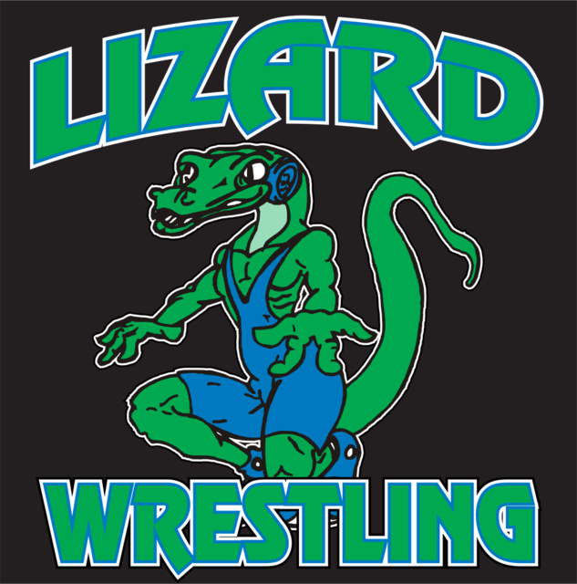

{:class="img-responsive" height="316px" width="320px"}

# About
Lizards start offical practices in November, three times a week for experienced wrestlers and twice a week for inexperienced wrestlers. We attend one of two match sessions on Sunday's 12:00-2:00 or 2:00-3:30.  

## Sign-ups  
Please use the link above to sign your wrestlers up. Fee is 70$ which includes a shirt and shorts. Payments and registrations are also available at open mats. 

## Open Mats  
Come check out we are and what we do! Open mats start October 5th 5:30-730, and will be held every thursday at Edgewood High School. Open mats are free of charge and open to anyone from any team or school ages 5-17. Focus will be on introducing the sport of wrestling to new wrestlers.

## Documents
- [2017 Flyer](_documents/Wrestling Flyer2017.docx) 
- [Registration Form](_documents/Registration Form.pdf)
